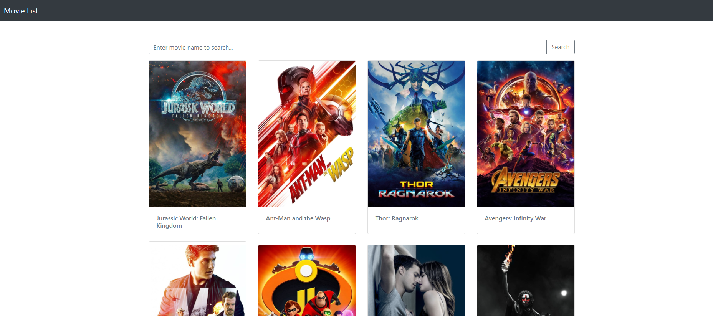

# 電影清單 movieList



## 介紹

觀看電影清單、詳細資訊以即可搜尋

### 功能

- 查看所有電影
- 瀏覽電影的詳細資訊
- 可以搜尋特定電影

## 開始使用

1. 請先確認有安裝 node.js 與 npm
2. 將專案 clone 到本地
   ```bash
   git clone https://github.com/duck-tech/movielist_express.git
   ```
3. 進入 restaurant_list 路徑
   ```bash
   cd restaurant_list
   ```
   
4. 在本地開啟之後，透過終端機，輸入：

   ```bash
   npm install
   ```

5. 安裝完畢後，繼續輸入：

   ```bash
   npm start
   ```

5. 若看見此行訊息則代表順利運行，打開瀏覽器進入到以下網址

   ```bash
   http://localhost:3000
   ```

6. 若欲暫停使用

   ```bash
   ctrl + c
   ```

## 開發工具

- Node.js 14.18.0
- Express 4.17.1
- Express-Handlebars 5.3.4
- Bootstrap 4.2.1
- Font Awesome 5.15.4
